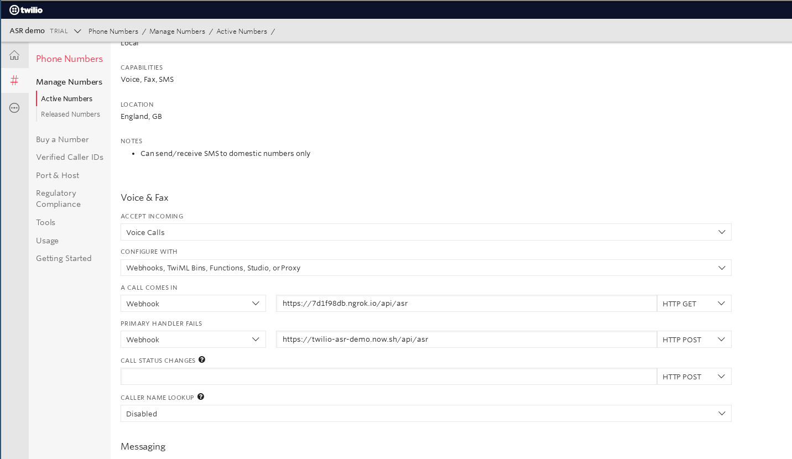

# babelforce | twilio | ASR

Hacky little POC app to demonstrate how babelforce can integrate with ASR in a twiML app.

### Prerequisites

* `ngrok`
* `node.js` & `npm`
* twilio account with an inbound number

### Run development server

```sh
# shell 1
$ ngrok http 8080

# shell 2
$ npm run dev
```

Ensure that the voice callback base URL for your twilio number is set to the `https://` variant of the proxy shown in the `ngrok` output (see images below). Configure the twilio part at https://www.twilio.com/console/phone-numbers/incoming.





---

## Todo

- [ ] test whole flow by enabling `res.end(twim.toString());` at end of `/thanks` route
- [ ] automate deployment to GCP function or AWS lambda (https://babelforce.atlassian.net/browse/BABSER-3566)
- [ ] tweak timeout and other settings to improve speech capture experience 


